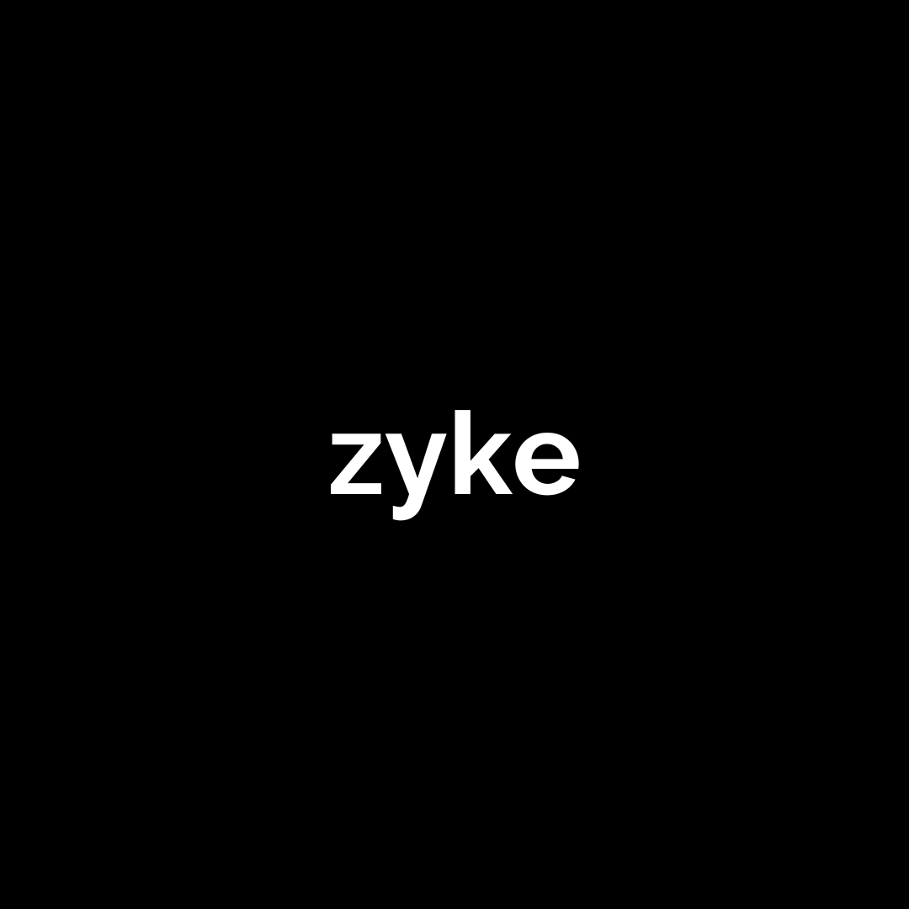

# Zyke — AI-Powered Social Media Automation

Empowering brands to ideate, design, and refine platform-ready social posts in minutes using GenAI. Zyke connects trend discovery, topic ideation, content generation, image editing, and payments into one cohesive pipeline.



<p align="center">
  <a href="https://nextjs.org/">Next.js 14</a> • 
  <a href="https://next-auth.js.org/">next-auth</a> • 
  <a href="https://tailwindcss.com/">Tailwind CSS</a> • 
  <a href="https://ui.shadcn.com/">shadcn/ui</a> • 
  <a href="https://www.framer.com/motion/">Framer Motion</a> • 
  <a href="https://www.razorpay.com/">Razorpay</a>
</p>

---

## TL;DR

- Authenticated users define a Brand Voice profile, then generate content ideas from trends, repurposed URLs, or manual topics.
- Ideas are transformed into platform-ready post bundles (captions + images).
- Users can edit images with click-to-segment masking and GenAI inpainting.
- Export assets and manage credits via Razorpay purchases.

Key entries:
- App shell: [TypeScript.RootLayout()](zyke-frontend/app/layout.tsx:22), session provider [TypeScript.ClientProvider()](zyke-frontend/components/ClientProvider.tsx:7)
- Auth: [TypeScript.authOptions()](zyke-frontend/app/api/auth/[...nextauth]/route.ts:14), [TypeScript.jwt()](zyke-frontend/app/api/auth/[...nextauth]/route.ts:101), [TypeScript.session()](zyke-frontend/app/api/auth/[...nextauth]/route.ts:128)
- Flow screens: [TypeScript.IdeaGenerator()](zyke-frontend/components/IdeaGenerator.tsx:326) → [TypeScript.GeneratedIdeas()](zyke-frontend/components/GeneratedIdeas.tsx:52) → [TypeScript.GeneratedPosts()](zyke-frontend/components/GeneratedPosts.tsx:777)
- Brand voice: [TypeScript.BrandVoiceCreator()](zyke-frontend/components/BrandVoice.tsx:164), viewer [TypeScript.BrandProfile()](zyke-frontend/components/BrandProfile.tsx:82)
- Guard: [TypeScript.ProtectedRoute()](zyke-frontend/components/ProtectedRoute.tsx:14)
- Payments: [TypeScript.Component()](zyke-frontend/components/payment/Credits.tsx:53)

---

## Table of Contents

- What is Zyke?
- Why Zyke? (Problem & Vision)
- What We’re Building (The Idea)
- Feature Highlights
- Architecture Overview
- Repository Structure
- Getting Started
- Environment Variables
- Scripts
- Core Flows (Step-by-step)
- Key Files & Constructs
- API Overview (Frontend usage)
- Screenshots
- Roadmap (Future Steps)
- Contributing
- Security & Privacy
- FAQ
- License
- Acknowledgements

---

## What is Zyke?

Zyke is a full-stack content pipeline that automates the social media lifecycle:
- Finds trends and repurposes external content into topic ideas
- Generates platform-ready post bundles (image sets + captions)
- Offers precision image editing via segmentation and GenAI inpainting
- Manages usage credits and payments

This repository contains the Next.js 14 frontend for the Zyke platform. For a deep technical tour, see the comprehensive documentation: [zyke-frontend/doc.md](zyke-frontend/doc.md)

---

## Why Zyke? (Problem & Vision)

Most teams spend hours per week ideating, drafting, designing, and iterating on social posts. Traditional workflows are fragmented across tools and formats. Zyke’s vision is a single, brand-informed pipeline where:
- Ideas come from real trends, repurposed sources, or manual prompts
- Design adapts to brand tone and visual guidelines
- Editing is AI-assisted, fast, and non-destructive
- Publishing pipelines are consistent and measurable

Long-term, Zyke aims to:
- Become a multi-platform, multi-brand content OS
- Provide analytics, collaboration, scheduling, and A/B testing
- Offer an SDK for custom integrations and automation

---

## What We’re Building (The Idea)

- A “from-idea-to-post” conveyor belt that starts with your brand voice and ends with platform-ready assets.
- AI-generated post concepts you can refine with pixel-level control.
- A growth engine that learns from engagement and optimizes creative cycles.
- An extensible platform where new sources, platforms, and tools can plug in.

---

## Feature Highlights

- Authentication with Google OAuth and Credentials via next-auth (JWT strategy)
- Brand Voice creation and gating of advanced flows
- Idea generation from:
  - Trends
  - Repurposed sources (Blog, YouTube, News, Website, Instagram Posts, Reels)
  - Manual custom topics
- Idea → Posts generation with backend persistence
- Advanced image workflow:
  - Click-to-segment region selection
  - Mask blending for previews
  - GenAI inpainting for object add/remove/replace
  - History and revert support
- Export ZIP (images + caption.txt)
- Credits & payments via Razorpay
- Polished UX: shadcn/ui + Tailwind + Framer Motion + React Spring

---

## Architecture Overview

Frontend (this repo)
- Next.js 14 (App Router + RSC) with TypeScript
- Auth via next-auth (JWT strategy; tokens issued by backend)
- Tailwind CSS and shadcn/ui for rapid, consistent UI
- Animations with Framer Motion and React Spring
- Client-only image editor modal with segmentation and inpainting requests

Backend (separate repository)
- Flask services provide: auth, trends, idea generation, repurpose, idea→post, segmentation blend, inpainting, credits/transactions

Top-level runtime components
- Layout: [TypeScript.RootLayout()](zyke-frontend/app/layout.tsx:22)
- Session: [TypeScript.ClientProvider()](zyke-frontend/components/ClientProvider.tsx:7)
- Guarding: [TypeScript.ProtectedRoute()](zyke-frontend/components/ProtectedRoute.tsx:14)

---

## Repository Structure

```
zyke-frontend/
  app/
    api/auth/[...nextauth]/route.ts
    idea-generator/page.tsx
    generated-ideas/page.tsx
    generated-posts/page.tsx
    brandvoice/page.tsx
    brandprofile/page.tsx
    signin/page.tsx
    credits/page.tsx
    layout.tsx
    page.tsx
  components/
    BrandVoice.tsx
    BrandProfile.tsx
    IdeaGenerator.tsx
    GeneratedIdeas.tsx
    GeneratedPosts.tsx
    ProtectedRoute.tsx
    ClientProvider.tsx
    payment/Credits.tsx
    ui/* (shadcn UI kit)
  hooks/
    use-toast.ts
  lib/
    authOptions.ts
    utils.ts
  utils/
    api.ts
  public/
    images/zyke.png
    generated/fixed.png
    posts/* sample assets
  tailwind.config.ts
  tsconfig.json
  next.config.mjs
```

---

## Getting Started

Prerequisites
- Node.js 18+
- npm 9+ (or pnpm/yarn)
- A running Zyke backend (Flask) and valid environment variables

Install
```
npm ci
```

Development
```
npm run dev
```

Build & Start
```
npm run build
npm start
```

---

## Environment Variables

Create zyke-frontend/.env.local with:

| Name | Required | Description |
| ---- | -------- | ----------- |
| NEXT_PUBLIC_BACKEND_URL | Yes | Base URL of Zyke Flask backend (e.g. https://api.example.com) |
| NEXT_PUBLIC_API_URL | Optional | Public trends API for utils (if used by [zyke-frontend/utils/api.ts](zyke-frontend/utils/api.ts)) |
| GOOGLE_CLIENT_ID | Yes | Google OAuth client ID for next-auth |
| GOOGLE_CLIENT_SECRET | Yes | Google OAuth client secret |
| JWT_SECRET_KEY | Yes | next-auth secret (JWT) |
| NEXT_PUBLIC_RAZORPAY_KEY | Yes | Razorpay publishable key for client checkout |

References in code:
- [TypeScript.authOptions()](zyke-frontend/app/api/auth/[...nextauth]/route.ts:14)
- [TypeScript.Component()](zyke-frontend/components/payment/Credits.tsx:283)

---

## Scripts

- dev: next dev
- build: next build
- start: next start
- lint: next lint

---

## Core Flows (Step-by-step)

1) Brand Voice
- New user signs in → if no profile, redirected to Brand Voice creator
- Create wizard: [TypeScript.BrandVoiceCreator()](zyke-frontend/components/BrandVoice.tsx:164)
- Profile viewer: [TypeScript.BrandProfile()](zyke-frontend/components/BrandProfile.tsx:82)

2) Idea Generation
- Entry: [TypeScript.IdeaGenerator()](zyke-frontend/components/IdeaGenerator.tsx:326)
- Trend path: [TypeScript.fetchTrendsAndIdeas()](zyke-frontend/components/IdeaGenerator.tsx:359)
- Repurpose path: [TypeScript.handleGetTopic()](zyke-frontend/components/IdeaGenerator.tsx:484) with content type mapping
- Custom topic path: manual { name, description } → ideas

3) Ideas → Posts
- Selection: [TypeScript.GeneratedIdeas()](zyke-frontend/components/GeneratedIdeas.tsx:52)
- Generate posts: [TypeScript.handleGenerateContent()](zyke-frontend/components/GeneratedIdeas.tsx:158) → backend persists → redirect to posts

4) Posts, Image Editing, Export
- View posts: [TypeScript.GeneratedPosts()](zyke-frontend/components/GeneratedPosts.tsx:777)
- Modal editing: [TypeScript.ImageModal()](zyke-frontend/components/GeneratedPosts.tsx:61)
  - Segmentation: [TypeScript.handleImageClick()](zyke-frontend/components/GeneratedPosts.tsx:117)
  - Mask selection: [TypeScript.handleMaskSelection()](zyke-frontend/components/GeneratedPosts.tsx:257)
  - Inpainting: [TypeScript.handleGenerate()](zyke-frontend/components/GeneratedPosts.tsx:386)
- Export ZIP: [TypeScript.handleExportPost()](zyke-frontend/components/GeneratedPosts.tsx:1031)

5) Credits & Payments
- Credits dashboard: [TypeScript.Component()](zyke-frontend/components/payment/Credits.tsx:53)
- Create order & pay: [TypeScript.handleAddCredits()](zyke-frontend/components/payment/Credits.tsx:210), [TypeScript.initializeRazorpay()](zyke-frontend/components/payment/Credits.tsx:374), [TypeScript.makePayment()](zyke-frontend/components/payment/Credits.tsx:241)

---

## Key Files & Constructs

- App shell: [TypeScript.RootLayout()](zyke-frontend/app/layout.tsx:22)
- Session provider: [TypeScript.ClientProvider()](zyke-frontend/components/ClientProvider.tsx:7)
- Auth route: [TypeScript.authOptions()](zyke-frontend/app/api/auth/[...nextauth]/route.ts:14) with [TypeScript.jwt()](zyke-frontend/app/api/auth/[...nextauth]/route.ts:101), [TypeScript.session()](zyke-frontend/app/api/auth/[...nextauth]/route.ts:128)
- Guard: [TypeScript.ProtectedRoute()](zyke-frontend/components/ProtectedRoute.tsx:14)
- Idea generator: [TypeScript.IdeaGenerator()](zyke-frontend/components/IdeaGenerator.tsx:326) with [TypeScript.fetchTrendsAndIdeas()](zyke-frontend/components/IdeaGenerator.tsx:359), [TypeScript.handleGetTopic()](zyke-frontend/components/IdeaGenerator.tsx:484)
- Ideas selection: [TypeScript.GeneratedIdeas()](zyke-frontend/components/GeneratedIdeas.tsx:52) with [TypeScript.handleGenerateContent()](zyke-frontend/components/GeneratedIdeas.tsx:158)
- Posts & editor: [TypeScript.GeneratedPosts()](zyke-frontend/components/GeneratedPosts.tsx:777), editor modal [TypeScript.ImageModal()](zyke-frontend/components/GeneratedPosts.tsx:61), [TypeScript.handleExportPost()](zyke-frontend/components/GeneratedPosts.tsx:1031)
- Brand voice: [TypeScript.BrandVoiceCreator()](zyke-frontend/components/BrandVoice.tsx:164)
- Brand profile: [TypeScript.BrandProfile()](zyke-frontend/components/BrandProfile.tsx:82)
- Payments: [TypeScript.Component()](zyke-frontend/components/payment/Credits.tsx:53)

---

## API Overview (Frontend usage)

Quick reference of endpoints the frontend calls (see details in [zyke-frontend/doc.md](zyke-frontend/doc.md)):

- Auth: /auth/login, /auth/oauth/callback, /auth/refresh
- Brand Voice: /brand_voice_info/profile, /brand_voice_info/create
- Trends & Ideas: /trends/fetch_trends, /trend_to_idea/generate_ideas
- Repurpose: /repurpose/repurpose_url
- Posts: /idea_to_post/fetch_posts, /fetch_last_post/get_stored_post
- Image: external /segment (cloud function), /blend/blend_masks, /inpaint/inpaint_image
- Payments: /transactions/user, /transactions/credits, /transactions/history, /transactions/history/:userId, /transactions/add

All authenticated calls include Authorization: Bearer <accessToken>.

---

## Screenshots

- Landing/Home: [TypeScript.HomePage()](zyke-frontend/components/HomePage.tsx:36)
- Idea Generator: [TypeScript.IdeaGenerator()](zyke-frontend/components/IdeaGenerator.tsx:326)
- Generated Ideas: [TypeScript.GeneratedIdeas()](zyke-frontend/components/GeneratedIdeas.tsx:52)
- Generated Posts & Editor: [TypeScript.GeneratedPosts()](zyke-frontend/components/GeneratedPosts.tsx:777)

You can replace this section with visual screenshots or GIFs to showcase the UX.

---

## Roadmap (Future Steps)

Near-term
- Add platform presets: X/Twitter, Facebook, Threads
- Expand repurpose sources: PDFs, sitemaps, podcast feeds
- Editable caption templates and tone sliders per platform
- Bulk scheduling integration with first-party APIs

Mid-term
- Collaboration: multi-user workspaces, roles, comments
- Analytics loop: measure engagement and feed back into idea scoring
- Style transfer and brand kit enforcement for images/videos
- Advanced export: package to CMS schedulers and asset managers

Long-term
- Plugin/SDK ecosystem for custom sources and generators
- Multi-brand portfolios and shared creative libraries
- In-app AB testing and auto-optimization

---

## Contributing

1) Fork and branch
2) Install deps with `npm ci`
3) Create a focused PR with:
- summary of change
- screenshots for UI changes
- notes on migration or environment assumptions

Code style
- Use shadcn/ui primitives and Tailwind utility classes
- Keep functions small and focused; prefer composition over large components
- Link business logic through typed helpers and clear payload interfaces

---

## Security & Privacy

- OAuth and credentials are handled by next-auth; refresh tokens never leave server callbacks
- Access tokens are stored in next-auth JWT and exposed for client calls as needed
- Payments are completed via Razorpay’s client SDK; sensitive payment data is not stored on the frontend
- Ensure NEXT_PUBLIC_BACKEND_URL uses HTTPS in production

---

## FAQ

- Why do I get 401 Unauthorized on idea generation?
  - Check that your session has a valid accessToken (re-login), and NEXT_PUBLIC_BACKEND_URL is correctly set.

- Generate Ideas returns a structure error?
  - Ensure the nested trends list is passed exactly as received from /trends/fetch_trends to /trend_to_idea/generate_ideas.

- Razorpay window doesn’t open?
  - Confirm NEXT_PUBLIC_RAZORPAY_KEY is present and the SDK script loads (see [TypeScript.initializeRazorpay()](zyke-frontend/components/payment/Credits.tsx:374)).

- Image editing doesn’t generate results?
  - Make sure a mask is selected first; remove toggles ignore prompt text by design (see [TypeScript.handleGenerate()](zyke-frontend/components/GeneratedPosts.tsx:386)).

---

## License

Proprietary. All rights reserved.

---

## Acknowledgements

- Next.js, Vercel, and the React community
- shadcn/ui for ergonomic UI primitives
- Framer Motion and React Spring for delightful UX
- Razorpay for robust payment rails

For a complete, in-depth code reference, see: [zyke-frontend/doc.md](zyke-frontend/doc.md)
